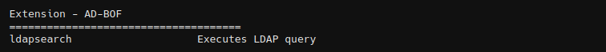
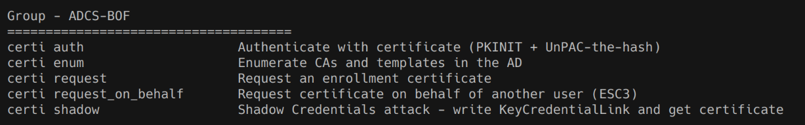
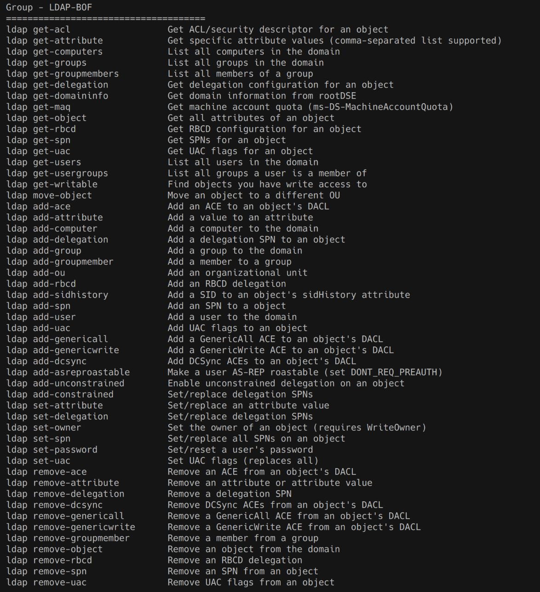
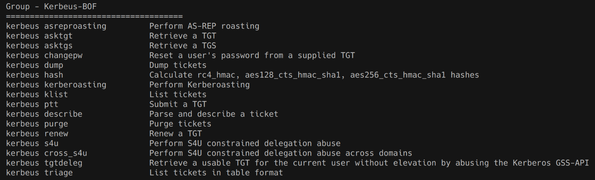
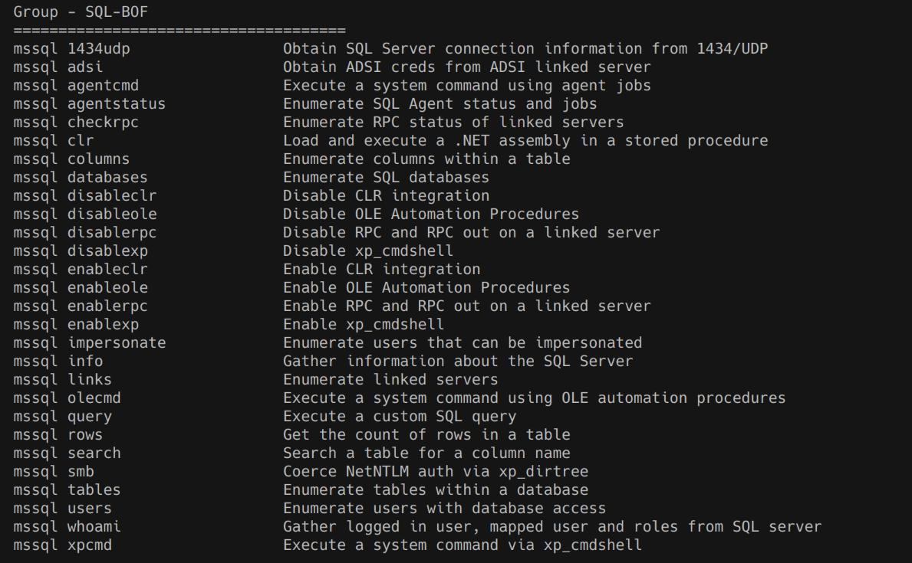

# AD-BOF

A BOFs that contains common enumeration and attack methods for Windows Active Directory.












## adwssearch

A Beacon Object File (BOF) for Active Directory enumeration through Active Directory Web Services (ADWS) compatible with BOFHound.
- Query AD objects using LDAP filters via ADWS protocol (TCP 9389)
- Automatic DC discovery or specify target DC
- Custom base DN support for querying Configuration, Schema, or other partitions
- Retrieve specific attributes or all attributes
- Automatic pagination for large result sets
- Support for all AD object types (users, computers, groups, PKI objects, trustedDomain, etc.)

```
adwssearch <query> [-a attributes] [--dc dc] [--dn dn]

# Get specific attributes for all users
adwssearch "(objectclass=user)" -a samaccountname,distinguishedname,memberof --dc dc01.domain.local

# Query ADCS Certificate Templates in Configuration partition
adwssearch "(objectClass=pKICertificateTemplate)" -a cn,displayname --dc dc01.domain.local --dn "CN=Configuration,DC=domain,DC=local"
```


## badtakeover

Beacon Object File (BOF) for Using the BadSuccessor Technique for Account Takeover

```
badtakeover <target_ou> <new_dmsa_account> <curren sid> <target_user_dn> <domain>
```


## certi

A library of beacon object files to interact with ADCS servers and certificates. [More details](https://github.com/Adaptix-Framework/Extension-Kit/blob/main/AD-BOF/ADCS-BOF/README.md)


## DCSync BOF

A BOF implementation of the DCSync attack for extracting credential material from Active Directory domain controllers. [More details](https://github.com/Adaptix-Framework/Extension-Kit/blob/main/AD-BOF/DCSync-BOF/README.md)


## kerbeus

Beacon Object Files for Kerberos abuse. This is an implementation of some important features of the [Rubeus](https://github.com/GhostPack/Rubeus) project, written in C. [More details](https://github.com/Adaptix-Framework/Extension-Kit/blob/main/AD-BOF/Kerbeus-BOF/README.md)


## ldapsearch

Execute LDAP searches (NOTE: specify *,ntsecuritydescriptor as attribute parameter if you want all attributes + base64 encoded ACL of the objects, this can then be resolved using BOFHound. Could possibly break pagination, although everything seemed fine during testing.)

```
ldapsearch <query> [-a attributes] [-c count>] [-s scope] [--dc dc] [--dn dn] [--ldaps]
```


## ldapq computers

Get a list of hosts in a domain via ldap and save them in TaskManager.

```
ldapq computers
```


## readlaps

Read LAPS password for a computer

```Shell
readlaps [-dc dc] [-dn dn] [-target target] [-target-dn target_dn]
```


## mssql

A library of Beacon Object Files to interact with remote SQL servers and data. This collection is templated off the TrustedSec CS-Situational-Awareness-BOF collection and models the functionality of the SQLRecon project. [More details](https://github.com/Adaptix-Framework/Extension-Kit/blob/main/AD-BOF/SQL-BOF/README.md)


## Credits
* CS-Situational-Awareness-BOF - https://github.com/trustedsec/CS-Situational-Awareness-BOF
* SQL-BOF - https://github.com/Tw1sm/SQL-BOF
* sekken-enum - https://github.com/Nomad0x7/sekken-enum
* BadTakeover-BOF - https://github.com/logangoins/BadTakeover-BOF
* DCSync-BOF - https://github.com/P0142/DCSync-Bof