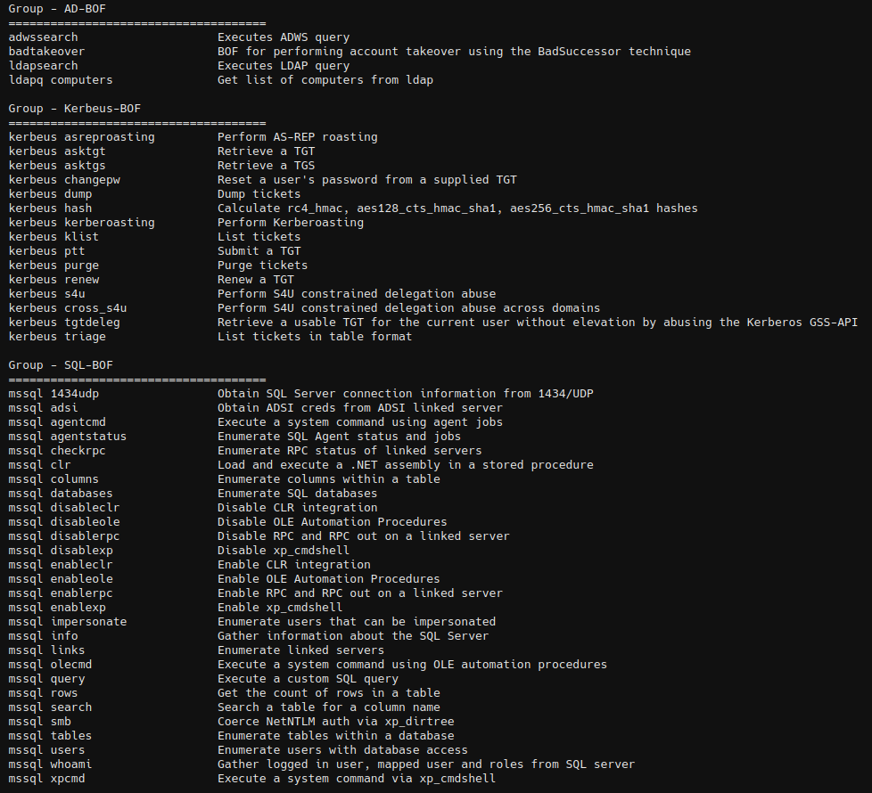

# AD-BOF

A BOFs that contains common enumeration and attack methods for Windows Active Directory.




## ldapsearch

Execute LDAP searches (NOTE: specify *,ntsecuritydescriptor as attribute parameter if you want all attributes + base64 encoded ACL of the objects, this can then be resolved using BOFHound. Could possibly break pagination, although everything seemed fine during testing.)

```
ldapsearch <query> [-a attributes] [-c count>] [-s scope] [--dc dc] [--dn dn] [--ldaps]
```


## ldapq computers

Get a list of hosts in a domain via ldap and save them in TaskManager.

```
ldapq computers
```


## kerbeus

Beacon Object Files for Kerberos abuse. This is an implementation of some important features of the [Rubeus](https://github.com/GhostPack/Rubeus) project, written in C. [More details](https://github.com/Adaptix-Framework/Extension-Kit/blob/main/AD-BOF/Kerbeus-BOF/README.md)


## Credits
* CS-Situational-Awareness-BOF - https://github.com/trustedsec/CS-Situational-Awareness-BOF
