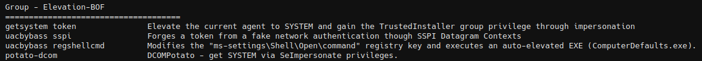
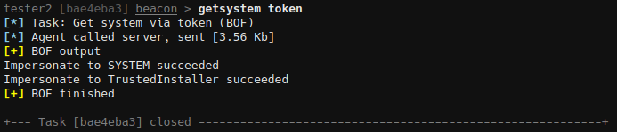

# Elevation-BOF

BOFs for context elevation




## getsystem token

Elevate the current agent to SYSTEM and gain the TrustedInstaller group privilege through impersonation.

```
getsystem token
```

The Get System item will be added to the Access menu in the table and the sessions column.




## uacbybass sspi

Forges a token from a fake network authentication though SSPI Datagram  Contexts. It will then impersonate the forged token and use CreateSvcRpc by [@x86matthew](https://twitter.com/x86matthew) to create a new SYSTEM service. Original research and code is from [@splinter_code](https://twitter.com/splinter_code).

```
uacbybass sspi <file.exe>
```


## uacbypass registryshellcmd

Modifies the "ms-settings\Shell\Open\command" registry key and executes an auto-elevated EXE (ComputerDefaults.exe).

```
uacbypass registryshellcmd <file.exe>
```


## potato-dcom

BOF version of [DCOMPotato](https://github.com/zcgonvh/DCOMPotato). Obtain SYSTEM privilege with SeImpersonate privilege by passing a malicious IUnknwon object to DCOM call of PrintNotify.

```
potato-dcom --token
potato-dcom --run <program with args>
```


## potato-print

BOF version of [PrintSpoofer](https://github.com/itm4n/PrintSpoofer). Provided that the current user has the SeImpersonate privilege, this tool will leverage the Print Spooler service to get a SYSTEM token and then run a custom command with CreateProcessAsUser().

```
potato-print --token
potato-print --run <program with args>
```


## Credits

* Elevate-System-Trusted-BOF - https://github.com/Mr-Un1k0d3r/Elevate-System-Trusted-BOF
* UAC-BOF-Bonanza - https://github.com/icyguider/UAC-BOF-Bonanza
* BOF-DCOMPotato-PrintNotify - https://github.com/Hagrid29/BOF-DCOMPotato-PrintNotify
* PrintSpoofer-BOF - https://github.com/SlimeOnSecurity/PrintSpoofer-BOF