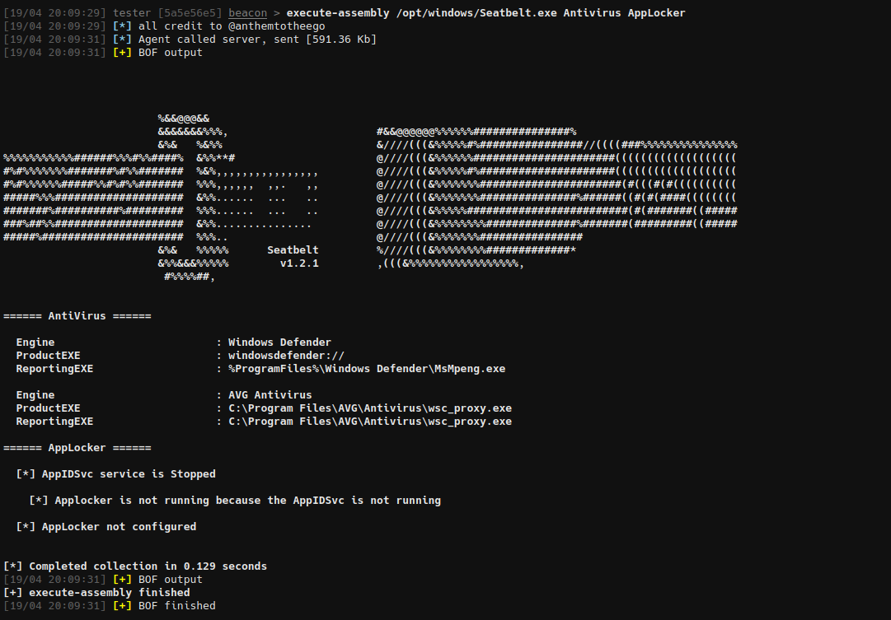

# Execution-BOF

BOFs for inline execution


## execute-assembly

Perform in process .NET assembly execution

```
> execute-assembly /opt/windows/Seatbelt.exe Antivirus AppLocker
```



## Hacks

The defaults are set as follows in `execute-assembly/inlineExecute-Assembly.c` to change them, edit and recompile.

```
	char* appDomain = "test";
	char* pipeName = "test";
	char* slotName = "test";
	BOOL amsi = 1;
	BOOL etw = 1;
	BOOL revertETW = 1;
	BOOL mailSlot = 0;
	ULONG entryPoint = 1;
```


## Credits

* InlineExecute-Assembly - https://github.com/anthemtotheego/InlineExecute-Assembly
* AMSI bypass - https://practicalsecurityanalytics.com/new-amsi-bypss-technique-modifying-clr-dll-in-memory/