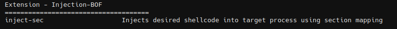
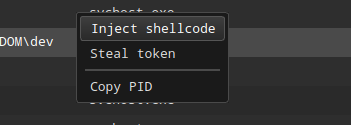
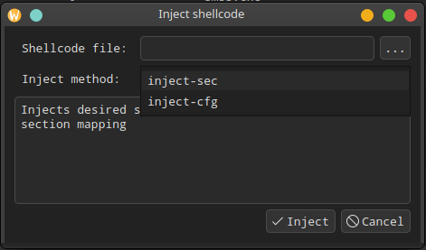

# Injection-BOF

Beacon Object Files for injects desired shellcode into target process



The **Inject** item will be added to the context menu in the Process Browser.






## inject-cfg

A beacon object file implementation of the process injection proof-of-concept from my blog post [Control Flow Hijacking via Data Pointers](https://www.legacyy.xyz/defenseevasion/windows/2025/04/16/control-flow-hijacking-via-data-pointers.html). Hijacks control flow via overwriting `combase.dll`'s Control Flow Guard function pointers called by COM proxying functions.
- From my testing, `explorer.exe` is the current best candidate in terms of an easy triggering mechanism due to its heavy reliance on COM proxying. Would recommend experimenting.
- **Make sure** shellcode is 64-bit as this BOF only supports 64-bit beacons & target processes.
- This has only been tested on windows versions `Win10 21H2 (19044.5737)` & `Win11 24H2 (26100.3775)`.

```
inject-cfg <pid> <shellcode file>
```


## inject-sec

Injects desired shellcode into target process using section mapping
```
inject-sec <pid> <shellcode file>
```


## inject-poolparty

A collection of process injection techniques abusing Windows Thread Pools. [**The Pool Party You Will Never Forget: New Process Injection Techniques Using Windows Thread Pools**](https://www.blackhat.com/eu-23/briefings/schedule/#the-pool-party-you-will-never-forget-new-process-injection-techniques-using-windows-thread-pools-35446)

| Variant ID  | Varient Description |
| ------------- | ----------------- |
| 1  | Overwrite the start routine of the target worker factory       |
| 2  | Insert TP_WORK work item to the target process's thread pool   |
| 3  | Insert TP_WAIT work item to the target process's thread pool   |
| 4  | Insert TP_IO work item to the target process's thread pool     |
| 5  | Insert TP_ALPC work item to the target process's thread pool   |
| 6  | Insert TP_JOB work item to the target process's thread pool    |
| 7  | Insert TP_DIRECT work item to the target process's thread pool |
| 8  | Insert TP_TIMER work item to the target process's thread pool  |

```
inject-poolparty <technique id> <pid> <shellcode file>
```

## Credits
* secinject - https://github.com/apokryptein/secinject
* DataInject-BOF - https://github.com/iilegacyyii/DataInject-BOF
* PoolParty - https://github.com/SafeBreach-Labs/PoolParty