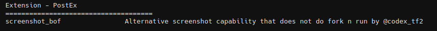
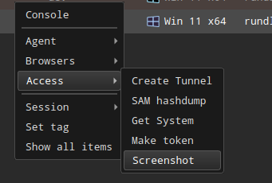

# PostEx-BOF

This extension allows you to customize the Beacon Object File (BOF) for future use.




## firewallrule

A BOF tool that can be used to add a new inbound or outbound firewall rule using COM.

```
firewallrule add <port> <rulename> [direction] [-g rulegroup] [-d description]
```


## ScreenshotBOF

An alternative screenshot capability that uses WinAPI and does not perform a fork & run:
- JPEG is used in place of BMP
- Added beacon screenshot callback option
- Removed BMP renderer (it will be missed)
- Supports capturing of minimized windows

The screenshot will be saved in the AdaptixC2 screenshot storage.

```
screenshot_bof [-n note] [-p pid]
```

The **Screenshot** item will be added to the **Access** menu in the Sessions Table and Graph.




## SauronEyeBOF

A file search tool ported from SauronEye to BOF format. Searches directories for files containing specific keywords:
- Search files by name patterns (supports wildcards * )
- Search file contents for keywords (with `-c` flag, supports wildcards * )
- Filter by file extensions
- Filter by file modification date
- Exclude system directories (Windows, AppData, Program Files)
- Configurable max file size

```
sauroneye [-d directories] [-f filetypes] [-k keywords] [-c] [-m maxfilesize] [-s] [-b beforedate] [-a afterdate] [-v] [-D] [-W wildcardattempts] [-S wildcardsize] [-B wildcardbacktrack]
```

Options:
- `-d directories`: Comma-separated list of directories to search (default: C:\)
- `-f filetypes`: Comma-separated list of file extensions (default: .txt,.docx)
- `-k keywords`: Comma-separated list of keywords with wildcards (default: none - matches all filenames). Used for searching in filenames and/or file contents
- `-c`: Search file contents for keywords. When enabled, searches inside files for keywords in addition to searching filenames
- `-m maxfilesize`: Max file size in KB for content search (default: 1024)
- `-s`: Search in system directories (default: false)
- `-b beforedate`: Filter files modified before date (format: dd.MM.yyyy)
- `-a afterdate`: Filter files modified after date (format: dd.MM.yyyy)
- `-v`: Check for VBA macros in Office files using OOXML detection (no OLE, stealthier)
- `-D`: Show file creation and modification dates in output. Format: `[C:dd.MM.yyyy M:dd.MM.yyyy]` where C: is creation date and M: is modification date
- `-W wildcardattempts`: Maximum pattern matching attempts for wildcard search (default: 1000). Increase for complex patterns
- `-S wildcardsize`: Maximum search area in KB for large files when using wildcards (default: 200KB). Increase to search more of large files
- `-B wildcardbacktrack`: Maximum backtracking operations for wildcard matching (default: 1000). Increase for complex patterns

Examples:
```
# Search only on C:\ drive (default)
sauroneye -f .docx
# Search on multiple drives
sauroneye -d C:\,D:\ -f .txt,.docx -k secret*,password*
# Search specific directories
sauroneye -d C:\Users,D:\Documents,E:\Backup -f .txt,.docx,.xlsx -k pass*,secret* -b 2024-01-01
```


## Credits
* ScreenshotBOF - https://github.com/CodeXTF2/ScreenshotBOF
* OperatorsKit - https://github.com/REDMED-X/OperatorsKit
* SauronEye-BOF - https://github.com/shashinma/SauronEye-BOF