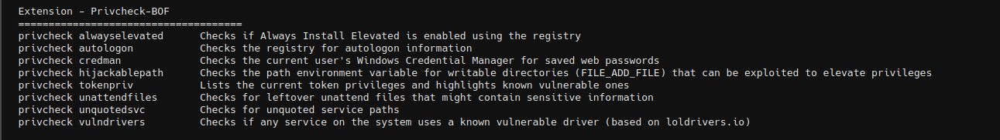

# PrivCheck-BOF

BOFs to detect common privilege escalation paths in Windows



This is taken from [ostrichgolf/PrivCheck](https://github.com/ostrichgolf/PrivCheck) which was originally forked from [mertdas/PrivKit](https://github.com/mertdas/PrivKit). 

Call modules with `privcheck` prefix...

```
> privcheck alwayselevated
```

PrivCheck currently includes the following modules:

| Module           | Description                                                  |
| ---------------- | ------------------------------------------------------------ |
| `alwayselevated` | Checks if `Always Install Elevated` is enabled using the registry. |
| `autologon`      | Checks the registry for autologon information.               |
| `credman`        | Checks the current user's Windows Credential Manager for saved web passwords and returns them. |
| `hijackablepath` | Checks the path environment variable for writable directories (`FILE_ADD_FILE`) that can be exploited to elevate privileges. |
| `tokenpriv`      | Lists the current token privileges and highlights known vulnerable ones. |
| `unattendfiles`  | Checks for leftover unattend files that might contain sensitive information. |
| `unquotedsvc`    | Checks for unquoted service paths.                           |
| `vulndrivers`    | Checks if any service on the system uses a known vulnerable driver (based on loldrivers.io).  *The list of vulnerable drivers is downloaded from `loldrivers.io` during compilation, then baked into the BOF. Recompile periodically to update* . |

## Credits

- https://github.com/ostrichgolf/PrivCheck