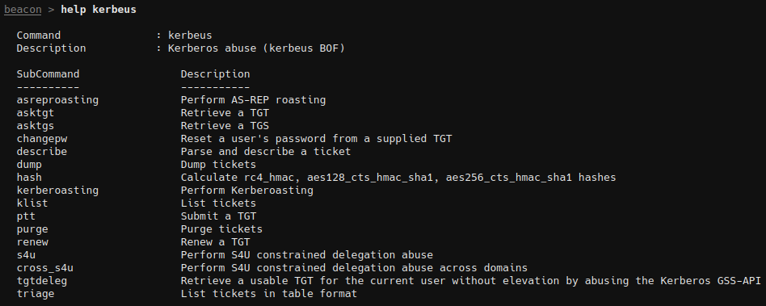

# Extension-Kit

Extension Kit for [AdaptixC2](https://github.com/Adaptix-Framework/AdaptixC2)

## Kerberus-BOF

Includes all Kerbeus-BOF commands: `asktgs`, `asktgt`, `asreproasting`, `changepw`, `describe`, `hash`, `kerberoasting`, `klist`, `ptt`, `purge`, `renew`, `s4u`, `tgtdeleg`. [More details](https://github.com/Adaptix-Framework/Extension-Kit/blob/main/Kerbeus-BOF/README.md)

## SAL-BOF

Situation Awareness Local BOFs: `arp`, `cacls`, `dir`, `env`, `ipconfig`, `listdns`, `netstat`, `nslookup`, `routerprint`, `uptime`, `whoami`. [More details](https://github.com/Adaptix-Framework/Extension-Kit/blob/main/SAL-BOF/README.md)

## SAR-BOF

Situation Awareness Local BOFs: `quser`. [More details](https://github.com/Adaptix-Framework/Extension-Kit/blob/main/SAR-BOF/README.md)

## Creds-BOF

BOF tools that can be used to harvest passwords [More details](https://github.com/Adaptix-Framework/Extension-Kit/blob/main/Creds-BOF/README.md)

## LateralMovement-BOF

BOFs for lateral movement with the specified method. Available methods: `PsExec`, `token make & steal` [More details](https://github.com/Adaptix-Framework/Extension-Kit/blob/main/LateralMovement-BOF/README.md)

## Elevation-BOF

BOFs for context elevation. [More details](https://github.com/Adaptix-Framework/Extension-Kit/blob/main/Elevation-BOF/README.md)

## Injection-BOF

Beacon Object Files for injects desired shellcode into target process: `inject-sec`. [More details](https://github.com/Adaptix-Framework/Extension-Kit/blob/main/Injection-BOF/README.md)

## Aliases

Simplification of some commands. [More details](https://github.com/Adaptix-Framework/Extension-Kit/blob/main/Aliases/README.md)
