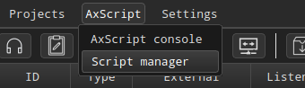
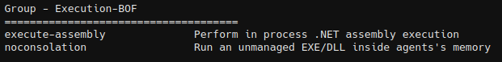
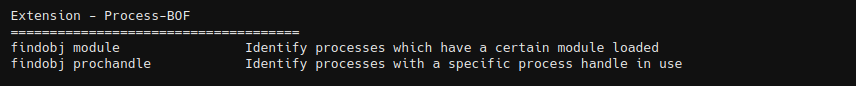

# Extension-Kit

Extension Kit for [AdaptixC2](https://github.com/Adaptix-Framework/AdaptixC2)

# Installation

```
# Ubuntu/Kali
apt install g++-mingw-w64-x86-64-posix  gcc-mingw-w64-x86-64-posix  mingw-w64-tools

# Arch
pacman -Syu mingw-w64-x86_64-gcc mingw-w64-x86_64-gcc-libs
```

Building modules via make

```bash
git clone https://github.com/Adaptix-Framework/Extension-Kit
cd Extension-Kit
make
```

Load all modules in AdaptixC2 client: **Main menu** -> **AxScript** -> **Script manager**. 



**Context menu** -> **Load new** and select the _extension-kit.axs_ file.

# Modules

## AD-BOF

A BOFs that contains common enumeration and attack methods for Windows Active Directory.


## Creds-BOF

BOF tools that can be used to harvest passwords [More details](https://github.com/Adaptix-Framework/Extension-Kit/blob/main/Creds-BOF/README.md)


## Elevation-BOF

BOFs for context elevation. [More details](https://github.com/Adaptix-Framework/Extension-Kit/blob/main/Elevation-BOF/README.md)


## Execution-BOF 

BOFs for inline execution. [More details](https://github.com/Adaptix-Framework/Extension-Kit/blob/main/Execution-BOF/README.md)




## Injection-BOF

Beacon Object Files for injects desired shellcode into target process. [More details](https://github.com/Adaptix-Framework/Extension-Kit/blob/main/Injection-BOF/README.md)


## LateralMovement-BOF

BOFs for lateral movement with the specified method. [More details](https://github.com/Adaptix-Framework/Extension-Kit/blob/main/LateralMovement-BOF/README.md)


## Process-BOF

BOFs that provide situational awareness of processes, modules, and services. [More details](https://github.com/Adaptix-Framework/Extension-Kit/blob/main/Process-BOF/README.md)




## Postex-BOF

This extension allows you to customize the Beacon Object File (BOF) for future use. [More details](https://github.com/Adaptix-Framework/Extension-Kit/blob/main/Postex-BOF/README.md)


## SAL-BOF

Situation Awareness Local BOFs. [More details](https://github.com/Adaptix-Framework/Extension-Kit/blob/main/SAL-BOF/README.md)


## SAR-BOF

Situation Awareness Local BOFs. [More details](https://github.com/Adaptix-Framework/Extension-Kit/blob/main/SAR-BOF/README.md)


# CONTRIBUTING

Please pushing сhanges to **dev** branch. Otherwise, changes will be made manually in the **dev** branch.
