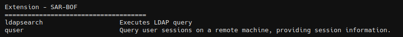

# SAR-BOF

This extension enhances situational awareness by providing a set of remote Beacon Object File (BOF) commands. These commands allow the operator to gather detailed information about the target.




## smartscan

Single-threaded silent port scanner

```
smartscan <targets> [-p mode/port_list]
```

**Modes**
1. fast
* Web services: 80, 443, 8080, 8443
* Databases: 1433, 1521, 3306, 5432, 6379, 27017
2. standart
* Web Services: 80, 443, 8080, 8443
* Databases: 1433, 1521, 3306, 5432, 6379, 27017
* Windows-specific: 135, 139, 445, 3389, 5985, 5986
* Linux-specific: 22
* Infrastructure: 21, 25, 53, 110, 143, 993, 995
3. full
* Web Services: 80, 443, 8080, 8443, 8000, 8888
* Databases: 1433, 1521, 3306, 5432, 6379, 27017, 9200, 9300
* Windows/Domain Controllers: 135, 139, 445, 3389, 5985, 5986, 88, 389, 636, 3268, 3269
* Linux/Unix: 22, 23
* Infrastructure: 21, 25, 53, 69, 110, 111, 143, 993, 995
* Other Services: 7, 9, 13, 19, 37, 79, 113, 119, 1025, 1434, 1604, 1723, 2000, 2001, 2048, 2049, 2100, 3128, 5000, 5060, 5061, 5900, 6000, 6667, 8081, 9000, 10000, 11211

```
smartscan 192.168.1.1 -p full

smartscan 192.168.1.1-192.168.1.10 -p standart

smartscan 192.168.1.1/24 -p 20-25,80-90,443
```


## taskhound

Collect scheduled tasks from remote systems, with options to filter for domain accounts with stored credentials and save XML task definitions for offline analysis. Can also collect DPAPI credential blobs and masterkeys for offline decryption.

```
taskhound <target> [username] [password] [-save <directory>] [-unsaved-creds] [-grab-blobs]
```

- `target` (required): Remote system to collect from (IP or hostname)
- `username` (optional): Username for authentication
- `password` (optional): Password for authentication
- `-save <directory>` (optional): Directory to save XML task files locally
- `-unsaved-creds` (optional): Show tasks without stored credentials (interactive token only)
- `-grab-blobs` (optional): Also collect credential blobs and masterkeys (requires `-save` flag)

```Shell
# Basic usage with current user context
taskhound 192.168.1.100

# Using explicit credentials
taskhound DC01 -u domain\admin -p P@ssw0rd

# Save XML files locally for offline analysis
taskhound 192.168.1.100 -save C:\TaskOutput

# Show all domain tasks including those without stored credentials
taskhound 192.168.1.100 -unsaved-creds

# Combined: save files and show all tasks
taskhound DC01 -u domain\admin -p P@ssw0rd -save C:\Output -unsaved-creds

# Collect tasks + credential blobs and masterkeys for offline decryption
taskhound 192.168.1.100 -save C:\TaskOutput -grab-blobs

# Full collection with credentials
taskhound DC01 -u domain\admin -p P@ssw0rd -save C:\Output -grab-blobs
```

**DPAPI Collection:**

When the `-grab-blobs` flag is used along with `-save`, TaskHound will additionally collect:
- **Credential Blobs**: `C:\Windows\System32\config\systemprofile\AppData\Local\Microsoft\Credentials\*`
- **SYSTEM Masterkeys**: `C:\Windows\System32\Microsoft\Protect\S-1-5-18\User\*`

These files are saved to:
- `<save_dir>\<hostname>\credentials\*` (credential blobs)
- `<save_dir>\<hostname>\masterkeys\*` (masterkeys)

The collected DPAPI files can be used with offline decryption tools to extract stored credentials from scheduled tasks.


## quser

Query user sessions on a remote machine, providing session information.

```
quser [host]
```


## Credits
* TaskHound - https://github.com/1r0BIT/TaskHound
* Quser-BOF - https://github.com/netero1010/Quser-BOF