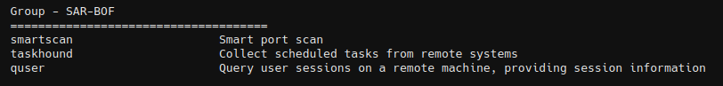

# SAR-BOF

This extension enhances situational awareness by providing a set of remote Beacon Object File (BOF) commands. These commands allow the operator to gather detailed information about the target.




## quser

Query user sessions on a remote machine, providing session information.

```
quser [host]
```


## Credits
* Quser-BOF - https://github.com/netero1010/Quser-BOF