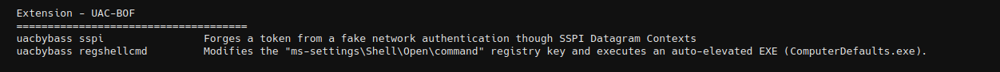
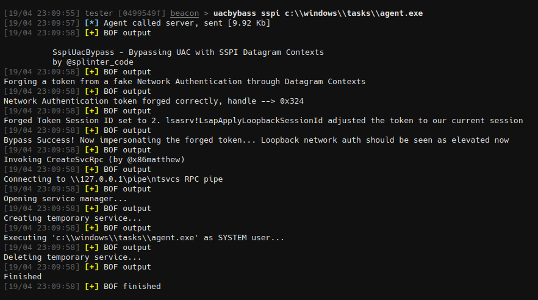

# UAC-BOF

BOFs for UAC bypass



## uacbybass-sspi

Forges a token from a fake network authentication though SSPI Datagram  Contexts. It will then impersonate the forged token and use CreateSvcRpc by [@x86matthew](https://twitter.com/x86matthew) to create a new SYSTEM service. Original research and code is from [@splinter_code](https://twitter.com/splinter_code).

```
> uacbybass sspi c:\\windows\\tasks\\agent.exe
```




## uacbypass-registryshellcmd

Modifies the "ms-settings\Shell\Open\command" registry key and executes an auto-elevated EXE (ComputerDefaults.exe).

```
> uacbypass registryshellcmd c:\\windows\\tasks\\agent.exe
```


## Credits

- https://github.com/icyguider/UAC-BOF-Bonanza